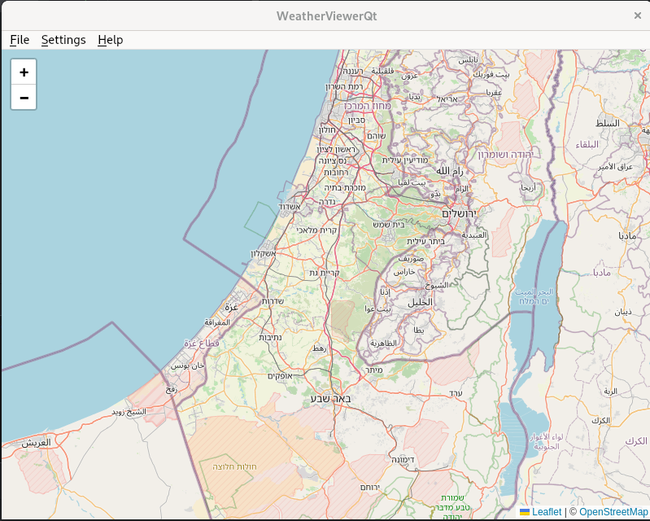

# WeatherViewerQt

WeatherViewerQt is a lightweight desktop application built with Qt and C++20 that provides an intuitive interface for viewing weather information. It is designed to be simple to run and easy to extend, serving as a solid foundation for exploring weather-related visualizations and UI work in a Qt environment.

## Features

- Resizable main window with a clear title “WeatherViewerQt”.
- Basic UI scaffold ready for integrating map views, weather layers, and data sources.
- Cross-platform desktop application (Windows, macOS, Linux) with a modern C++20 codebase.
- Simple entry point that initializes a Qt application, creates the main window, and starts the event loop.

> This repository is a starting point. The core UI and weather visualization components can be extended to fetch real-time data, render weather layers, and provide interactive controls.

## Screenshot

Note: If you prefer a friendlier filename, you can rename the image to something like `weather_viewer_screenshot.png` and update the README image reference accordingly.

## Technologies

- C++20
- Qt (for GUI, windowing, and event handling)
- CMake (build system configuration)

## Getting Started

### Prerequisites

- A C++20-compatible compiler
- Qt development environment (Qt 6 or newer recommended)
- CMake

### Build Instructions

1. Create a build directory:
    - Windows/macOS/Linux: `mkdir build && cd build`
2. Configure the project with CMake:
    - `cmake .. -DCMAKE_BUILD_TYPE=Release`
3. Build:
    - `cmake --build . --config Release`
4. Run:
    - On Linux/macOS: `./WeatherViewerQt`
    - On Windows: `WeatherViewerQt.exe` (in the build output directory)

### Running from Source

- Ensure Qt and a suitable compiler are installed.
- Build as described above.
- Launch the application to open a window titled “WeatherViewerQt”.

## Project Structure (high level)

- Core: Basic Qt application bootstrap and main window management.
- UI: Window and layout components that can host weather-related visualizations.
- Data: Placeholder for integrating weather data sources (APIs, local files, etc.).
- Build: CMake configuration to support C++20 and Qt.

## How to Contribute

- Fork the repository.
- Create a feature branch.
- Implement UI enhancements, new visualization modules, or data integrations.
- Run the project locally and ensure it builds with your changes.
- Submit a pull request with a clear description of the changes.

## License

Specify your preferred license here (e.g., MIT, Apache-2.0, GPL-3.0). If you haven’t chosen one yet, you can start with MIT for permissive usage.

## Changelog

- See the Changes file in the repository for details about recent updates.

## Push to GitHub (quick guide)

- Ensure you’ve committed your changes:
    - git add README.md
    - git commit -m "docs(readme): add WeatherViewerQt README with overview and build instructions"
- Push to the main branch (or your feature branch):
    - git push origin main
    - or git push origin your-feature-branch
- Open a pull request on GitHub if you’re contributing to a shared repository.

---